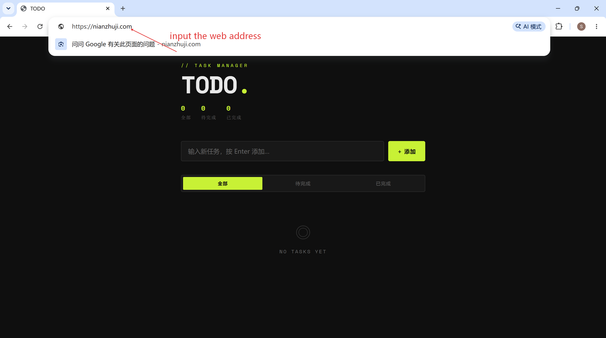
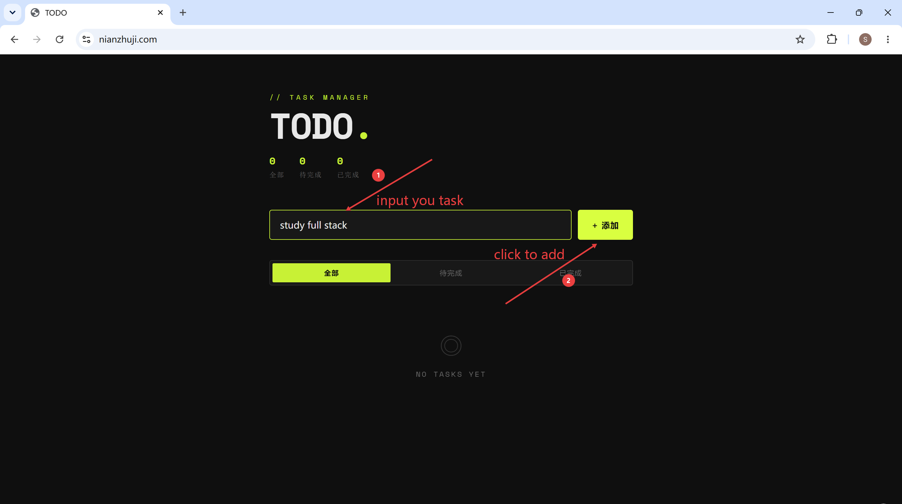
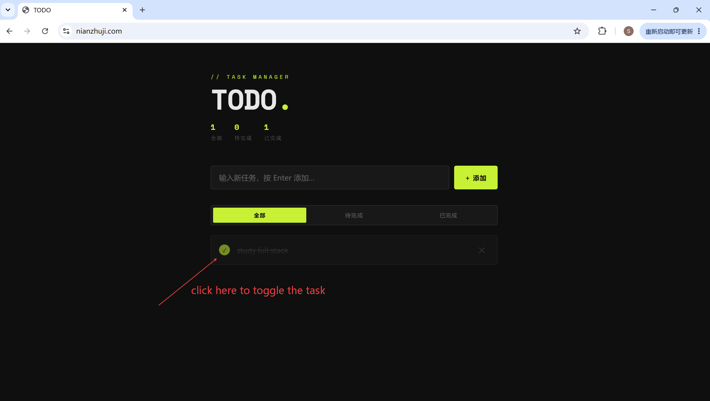
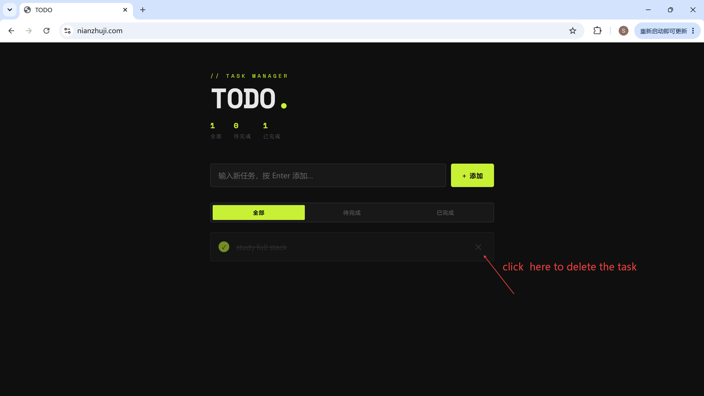

# Todo Web App

A full-stack Todo web application built with Flask, SQLite, Gunicorn, Nginx, and HTTPS deployment.

Live Demo:

https://nianzhuji.com

---

## Overview

Todo Web App is a small full-stack web project that allows users to create, view, complete, and delete todo tasks.

This project started as a simple Python CLI todo application and was gradually upgraded into a deployed web application with frontend interaction, backend APIs, SQLite persistence, production-style service management, Nginx reverse proxy, domain binding, and HTTPS.

---

## Features

* Add todo tasks
* View todo task list
* Toggle todo completion status
* Delete todo tasks
* Persist data with SQLite
* Health check endpoint
* Responsive web interface
* HTTPS domain access
* Production-style deployment with Gunicorn and Nginx

---

## Tech Stack

### Frontend

* HTML
* CSS
* JavaScript
* Fetch API

### Backend

* Python
* Flask
* REST-style API
* SQLite

### Deployment

* Ubuntu VPS
* Gunicorn
* systemd
* Nginx
* Certbot
* HTTPS
* UFW firewall

---

## Live Demo

Visit:

https://nianzhuji.com

---

## Screenshots






---

## Architecture

```text
User Browser
    ↓
HTTPS Domain
    ↓
Nginx :443
    ↓
Gunicorn 127.0.0.1:8000
    ↓
Flask Application
    ↓
SQLite Database
```

---

## API Endpoints

| Method | Endpoint                 | Description        |
| ------ | ------------------------ | ------------------ |
| GET    | `/`                      | Render web page    |
| GET    | `/health`                | Health check       |
| GET    | `/api/todos`             | Get all todos      |
| POST   | `/api/todos`             | Create a new todo  |
| PATCH  | `/api/todos/<id>/toggle` | Toggle todo status |
| DELETE | `/api/todos/<id>`        | Delete todo        |

---

## Project Structure

```text
todo_app/
├── app.py
├── db.py
├── requirements.txt
├── README.md
├── .env.example
├── .gitignore
└── templates/
    └── index.html
```

---

## Environment Variables

Create a `.env` file based on `.env.example` if needed.

```env
FLASK_DEBUG=false
PORT=5000
SECRET_KEY=change-me
```

The app loads local environment variables with `python-dotenv`.

---

## Local Development

Install dependencies:

```bash
pip install -r requirements.txt
```

Run the app locally:

```bash
python app.py
```

Open:

```text
http://127.0.0.1:5000
```

---

## Production Deployment

The app is deployed on an Ubuntu VPS.

Production-style runtime:

```text
Nginx → Gunicorn → Flask → SQLite
```

Gunicorn is managed by systemd and listens internally on:

```text
127.0.0.1:8000
```

Nginx listens publicly on:

```text
80 / 443
```

HTTPS is configured with Certbot.

---

## Security Notes

* `.env` is ignored by Git
* `todo.db` is ignored by Git
* Gunicorn only listens on localhost
* Nginx handles public HTTP/HTTPS traffic
* UFW firewall is enabled
* Only necessary ports are exposed
* HTTPS is enabled with automatic certificate renewal

---

## What I Learned

Through this project, I practiced:

* Python project structure
* Flask backend development
* REST-style API design
* Frontend and backend communication with Fetch API
* SQLite persistence
* Git and GitHub workflow
* Linux server deployment
* Gunicorn process management
* systemd service management
* Nginx reverse proxy
* HTTPS configuration
* Basic server security hardening

---

## Future Improvements

* Add user authentication
* Add task priority and due date
* Add soft delete and restore
* Add PostgreSQL support
* Add Docker deployment
* Add automated tests
* Add AI-powered task planning
* Add frontend framework version with React

---

## Repository

This project is part of my AI Full Stack / AI Product Engineer learning journey.

